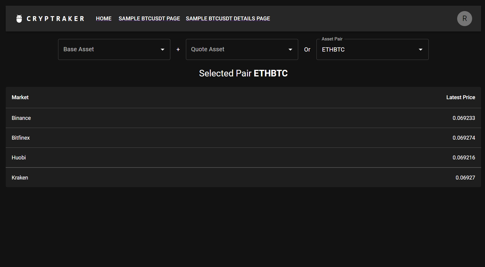
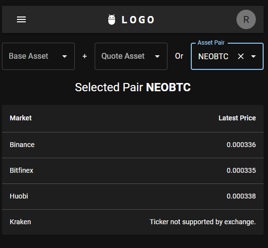
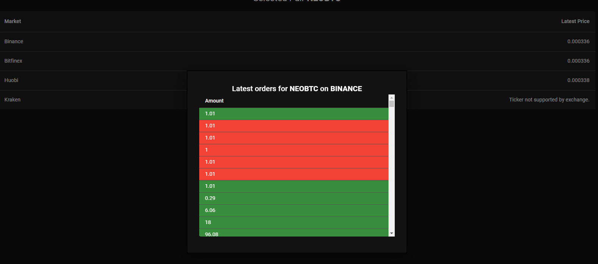
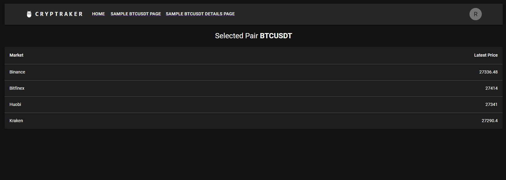
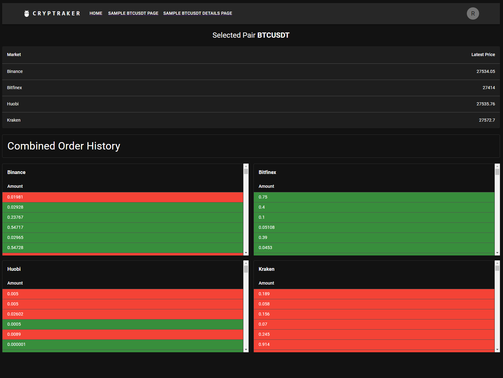

# Demo Crypto Market Watcher



### To start the project run the following commands:

```
yarn
yarn start
```

`yarn start` is modified to start both the node.js backend and react SPA at the same time.

In order to avoid CORS errors, the client had to run web browser extension OR as it is in this case, all the requests
are sent to the local node.js backend that has the `cors` plugin which solves the mentioned issue.

> *All data is re-fetched each 5 seconds!*

> *All Tables support `ASC/DESC` sorting, although, by default the order is from newest to oldest orders.*

### Available pages

`/` - Home (allows the user to select manually the assets OR select predefined pair)

- if the selected pair is not available on the exchange, the user should not encounter any errors and instead the
  following message should be displayed:



- if the user clicks on any market row a modal should pop-up showing the latest trade for the selected asset pair.



`/:pair` Direct share-able link to a specific pair.



`/:pair/details` - Details page for asset pair that also shows the latest trades from all markets.

